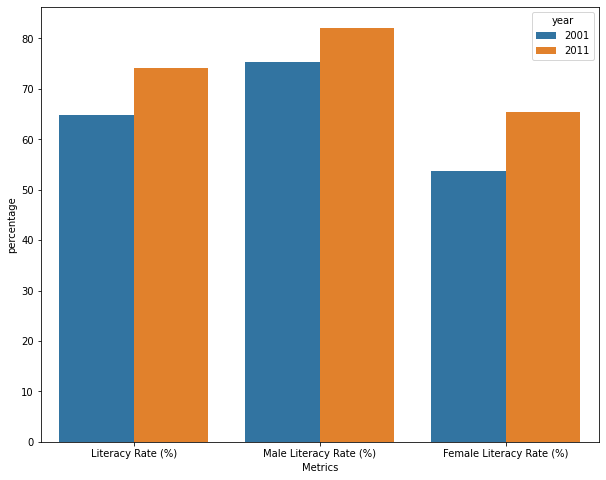

```python
import camelot
import seaborn as sns
import matplotlib.pyplot as plt
```


```python
pdf = camelot.read_pdf('./SampleTable.pdf', pages='1,2', flavor='lattice')
pdf
```


    <TableList n=4>


```python
for table in pdf:
    print(table)
```

    <Table shape=(4, 3)>
    <Table shape=(15, 3)>
    <Table shape=(14, 4)>
    <Table shape=(13, 3)>
    


```python
pdf[2].df
```


<div>
<table border="1" class="dataframe">
  <thead>
    <tr style="text-align: right;">
      <th></th>
      <th>0</th>
      <th>1</th>
      <th>2</th>
      <th>3</th>
    </tr>
  </thead>
  <tbody>
    <tr>
      <th>0</th>
      <td>Human Development Indicators</td>
      <td></td>
      <td>2000</td>
      <td>2011</td>
    </tr>
    <tr>
      <th>1</th>
      <td>13</td>
      <td>Human Development Index Value (HDI)</td>
      <td>0.461</td>
      <td>0.547</td>
    </tr>
    <tr>
      <th>2</th>
      <td>14</td>
      <td>HDI Rank (out of 187)</td>
      <td></td>
      <td>134</td>
    </tr>
    <tr>
      <th>3</th>
      <td>15</td>
      <td>Inequality Adjusted Human Development Index Value</td>
      <td></td>
      <td>0.392</td>
    </tr>
    <tr>
      <th>4</th>
      <td>16</td>
      <td>Loss in HDI due to Inequalities (%)</td>
      <td></td>
      <td>28.7</td>
    </tr>
    <tr>
      <th>5</th>
      <td></td>
      <td></td>
      <td>2001</td>
      <td>2011</td>
    </tr>
    <tr>
      <th>6</th>
      <td>17</td>
      <td>Gender Inequality Index (GII)</td>
      <td>0.5531</td>
      <td>0.617</td>
    </tr>
    <tr>
      <th>7</th>
      <td>18</td>
      <td>GII Rank (out of 146)</td>
      <td></td>
      <td>129</td>
    </tr>
    <tr>
      <th>8</th>
      <td></td>
      <td></td>
      <td>1996</td>
      <td>2006</td>
    </tr>
    <tr>
      <th>9</th>
      <td>19</td>
      <td>Gender Empowerment Measure (GEM)</td>
      <td>0.416</td>
      <td>0.497</td>
    </tr>
    <tr>
      <th>10</th>
      <td></td>
      <td></td>
      <td>2001</td>
      <td>2011</td>
    </tr>
    <tr>
      <th>11</th>
      <td>20</td>
      <td>Literacy Rate (%)</td>
      <td>64.8</td>
      <td>74.04</td>
    </tr>
    <tr>
      <th>12</th>
      <td>21</td>
      <td>Male Literacy Rate (%)</td>
      <td>75.3</td>
      <td>82.14</td>
    </tr>
    <tr>
      <th>13</th>
      <td>22</td>
      <td>Female Literacy Rate (%)</td>
      <td>53.7</td>
      <td>65.46</td>
    </tr>
  </tbody>
</table>
</div>


```python
df = pdf[2].df.loc[11:, 1:].reset_index(drop=True)
df
```


<div>
<table border="1" class="dataframe">
  <thead>
    <tr style="text-align: right;">
      <th></th>
      <th>1</th>
      <th>2</th>
      <th>3</th>
    </tr>
  </thead>
  <tbody>
    <tr>
      <th>0</th>
      <td>Literacy Rate (%)</td>
      <td>64.8</td>
      <td>74.04</td>
    </tr>
    <tr>
      <th>1</th>
      <td>Male Literacy Rate (%)</td>
      <td>75.3</td>
      <td>82.14</td>
    </tr>
    <tr>
      <th>2</th>
      <td>Female Literacy Rate (%)</td>
      <td>53.7</td>
      <td>65.46</td>
    </tr>
  </tbody>
</table>
</div>


```python
df.columns = ['Metrics', '2001', '2011']
df
```


<div>
<table border="1" class="dataframe">
  <thead>
    <tr style="text-align: right;">
      <th></th>
      <th>Metrics</th>
      <th>2001</th>
      <th>2011</th>
    </tr>
  </thead>
  <tbody>
    <tr>
      <th>0</th>
      <td>Literacy Rate (%)</td>
      <td>64.8</td>
      <td>74.04</td>
    </tr>
    <tr>
      <th>1</th>
      <td>Male Literacy Rate (%)</td>
      <td>75.3</td>
      <td>82.14</td>
    </tr>
    <tr>
      <th>2</th>
      <td>Female Literacy Rate (%)</td>
      <td>53.7</td>
      <td>65.46</td>
    </tr>
  </tbody>
</table>
</div>


```python
import pandas as pd
import numpy as np
```


```python
df.info()
```

    <class 'pandas.core.frame.DataFrame'>
    RangeIndex: 3 entries, 0 to 2
    Data columns (total 3 columns):
     #   Column   Non-Null Count  Dtype 
    ---  ------   --------------  ----- 
     0   Metrics  3 non-null      object
     1   2001     3 non-null      object
     2   2011     3 non-null      object
    dtypes: object(3)
    memory usage: 200.0+ bytes
    


```python
df.loc[:, ['2001', '2011']] = df.loc[:, ['2001', '2011']].astype(np.float32)
df
```


<div>
<table border="1" class="dataframe">
  <thead>
    <tr style="text-align: right;">
      <th></th>
      <th>Metrics</th>
      <th>2001</th>
      <th>2011</th>
    </tr>
  </thead>
  <tbody>
    <tr>
      <th>0</th>
      <td>Literacy Rate (%)</td>
      <td>64.800003</td>
      <td>74.040001</td>
    </tr>
    <tr>
      <th>1</th>
      <td>Male Literacy Rate (%)</td>
      <td>75.300003</td>
      <td>82.139999</td>
    </tr>
    <tr>
      <th>2</th>
      <td>Female Literacy Rate (%)</td>
      <td>53.700001</td>
      <td>65.459999</td>
    </tr>
  </tbody>
</table>
</div>


```python
df.to_csv('SampleTable.csv', index=False)
```


```python
df = pd.read_csv('./SampleTable.csv')
df
```


<div>
<table border="1" class="dataframe">
  <thead>
    <tr style="text-align: right;">
      <th></th>
      <th>Metrics</th>
      <th>2001</th>
      <th>2011</th>
    </tr>
  </thead>
  <tbody>
    <tr>
      <th>0</th>
      <td>Literacy Rate (%)</td>
      <td>64.800003</td>
      <td>74.040001</td>
    </tr>
    <tr>
      <th>1</th>
      <td>Male Literacy Rate (%)</td>
      <td>75.300003</td>
      <td>82.139999</td>
    </tr>
    <tr>
      <th>2</th>
      <td>Female Literacy Rate (%)</td>
      <td>53.700001</td>
      <td>65.459999</td>
    </tr>
  </tbody>
</table>
</div>


```python
df_melted = df.melt('Metrics', var_name='year', value_name='percentage')
df_melted
```


<div>
<table border="1" class="dataframe">
  <thead>
    <tr style="text-align: right;">
      <th></th>
      <th>Metrics</th>
      <th>year</th>
      <th>percentage</th>
    </tr>
  </thead>
  <tbody>
    <tr>
      <th>0</th>
      <td>Literacy Rate (%)</td>
      <td>2001</td>
      <td>64.800003</td>
    </tr>
    <tr>
      <th>1</th>
      <td>Male Literacy Rate (%)</td>
      <td>2001</td>
      <td>75.300003</td>
    </tr>
    <tr>
      <th>2</th>
      <td>Female Literacy Rate (%)</td>
      <td>2001</td>
      <td>53.700001</td>
    </tr>
    <tr>
      <th>3</th>
      <td>Literacy Rate (%)</td>
      <td>2011</td>
      <td>74.040001</td>
    </tr>
    <tr>
      <th>4</th>
      <td>Male Literacy Rate (%)</td>
      <td>2011</td>
      <td>82.139999</td>
    </tr>
    <tr>
      <th>5</th>
      <td>Female Literacy Rate (%)</td>
      <td>2011</td>
      <td>65.459999</td>
    </tr>
  </tbody>
</table>
</div>


```python
plt.figure(figsize=(10, 8))
sns.barplot(x='Metrics', y='percentage', hue='year', data=df_melted);
```


    

    

